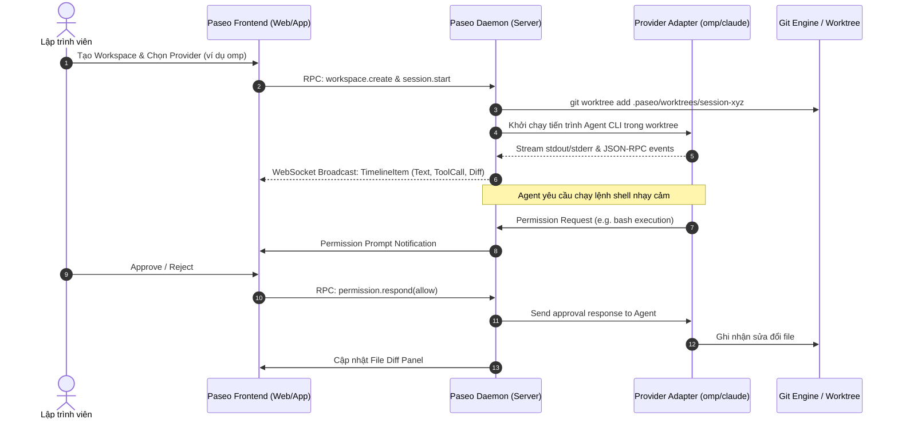

# PASEO: TỔNG QUAN KIẾN TRÚC & HƯỚNG DẪN TOÀN DIỆN
### *The Open-Source, Local-First Agentic Development Environment (ADE)*

---

## 1. Paseo Là Gì? (Bản Chất & Tầm Nhìn)

**Paseo** là một **Môi trường Phát triển Tự trị dựa trên Agent (Agentic Development Environment - ADE)** mã nguồn mở, hoạt động theo triết lý **Local-First**, **Zero-Telemetry** và **Multi-Agent / Multi-Provider**.

Trong kỷ nguyên mà các trợ lý lập trình chuyển dịch từ *viết code gợi ý (Copilot inline)* sang *agent độc lập giải quyết trọn vẹn task (Autonomous Coding Agents)* như Claude Code, OpenAI Codex CLI, GitHub Copilot CLI, OpenCode, Pi (`omp`), các lập trình viên đối mặt với các vấn đề lớn:
1. **Phân mảnh công cụ**: Mỗi agent có một CLI riêng, định dạng log riêng, không có giao diện trực quan thống nhất để theo dõi tiến độ, diffs, tool calls, timeline và file changes.
2. **Xung đột mã nguồn (Code Collision)**: Khi chạy nhiều agent cùng lúc trên một repository, các agent sẽ ghi đè file của nhau nếu không được cô lập môi trường làm việc.
3. **Phụ thuộc Cloud & Rủi ro bảo mật**: Nhiều công cụ SaaS yêu cầu đồng bộ toàn bộ codebase lên máy chủ bên thứ ba, vi phạm chính sách bảo mật nội bộ của doanh nghiệp.
4. **Trải nghiệm di động/từ xa kém**: Không thể theo dõi hoặc can thiệp agent đang chạy trên máy tính bàn khi đang di chuyển nếu không mở port SSH / port forwarding phức tạp.

**Paseo giải quyết triệt để các vấn đề này** bằng cách cung cấp một Daemon cục bộ điều phối toàn bộ các Agent thông qua Git Worktrees, kết hợp giao diện đa nền tảng (Desktop, Web, iOS, Android) và Relay mã hóa đầu cuối (E2E Encrypted Relay).

```
+-------------------------------------------------------------------------------+
|                                  PASEO APPS                                   |
|   Desktop (Electron)  |   Web (Browser)   |   Mobile (iOS / Android Expo)     |
+-------------------------------------------------------------------------------+
                                       |
                   WebSocket (Local RPC) / E2E Encrypted Relay
                                       |
+-------------------------------------------------------------------------------+
|                                PASEO DAEMON                                   |
|  - Agent Lifecycle Manager         - Workspace & Git Worktree Isolator       |
|  - Storage Engine (~/.paseo)       - MCP Tools Catalog & Dispatcher           |
|  - Plugin Runtime & Voice Gateway  - Timeline & File Diff Tracker             |
+-------------------------------------------------------------------------------+
        |                 |                  |                 |
+---------------+ +---------------+  +---------------+  +---------------+
|  Claude Code  | | OpenAI Codex  |  |  Oh My Pi     |  | Mock / Custom |
|   Provider    | |   Provider    |  |  (omp) Prov.  |  |   Providers   |
+---------------+ +---------------+  +---------------+  +---------------+
        |                 |                  |                 |
+-------------------------------------------------------------------------------+
|                       GIT WORKTREES (Isolated Paths)                          |
|  .paseo/worktrees/agent-1  |  .paseo/worktrees/agent-2  |  main repository   |
+-------------------------------------------------------------------------------+
```

---

## 2. Các Trụ Cột Triết Lý Thiết Kế (Core Philosophies)

1. **Local-First & Data Sovereignty (Chủ quyền dữ liệu cục bộ)**:
   - Toàn bộ dữ liệu phiên làm việc, lịch sử tương tác, cấu hình workspace được lưu trữ trực tiếp trên ổ cứng người dùng (`~/.paseo`).
   - Tuyệt đối không gửi telemetry, tracking hay phân tích hành vi người dùng về bất kỳ máy chủ nào.
2. **Agent-Agnostic & Multi-Provider**:
   - Không thiên vị bất kỳ mô hình AI hay nhà cung cấp nào. Paseo xây dựng lớp Provider Adapter chuẩn hóa cho phép cắm/rút bất kỳ Agent CLI nào:
     - `Claude Code` (Anthropic)
     - `Codex CLI` (OpenAI)
     - `GitHub Copilot CLI` (GitHub / Microsoft)
     - `Oh My Pi (omp)` & `Pi`
     - `OpenCode`
     - `Muse Code` & `Antigravity`
     - `Mock Load Test Provider` (để kiểm thử hiệu năng & giao diện mà không tốn chi phí token)
3. **Git Worktree Isolation (Cô lập qua Git Worktree)**:
   - Mỗi phiên làm việc (Session/Turn) của một agent có thể được cấp phát một Git Worktree riêng biệt.
   - Các agent có thể sửa đổi code, chạy test, build đồng thời mà không chạm vào thư mục làm việc chính (`main working tree`) của lập trình viên.
   - Giao diện Paseo cung cấp Diff Viewer trực quan và tính năng `Apply / Revert / Merge` để người dùng kiểm soát chính xác những gì được đưa vào mã nguồn chính.
4. **Omnichannel Access (Truy cập mọi nơi với E2E Relay)**:
   - Làm việc trên máy tính bàn tại văn phòng, sau đó mở app di động (iOS/Android) trên đường về để theo dõi tiến độ agent và phản hồi các câu hỏi cấp quyền (Permission prompts) an toàn qua Relay mã hóa AES-GCM.
5. **Extensible Plugin Ecosystem**:
   - Hỗ trợ plugin mở rộng UI, thêm custom MCP tools, custom themes, lifecycle hooks và voice processing.

---

## 3. Bản Đồ Cấu Trúc Monorepo & Chi Tiết Từng Gói (Packages)

Mã nguồn Paseo được tổ chức dưới dạng npm workspaces tại thư mục `packages/`:

| Tên Package | Đường dẫn | Vai trò & Trách nhiệm |
|:---|:---|:---|
| `@paseo/protocol` | `packages/protocol` | Định nghĩa toàn bộ schema trao đổi dữ liệu (TypeScript types, RPC interfaces, WebSocket message frames, session states, timeline events, permission requests). |
| `@paseo/server` | `packages/server` | Trái tim của Paseo: Daemon chạy nền, quản lý workspace, lưu trữ CSDL SQLite/JSON tại `~/.paseo`, điều phối tiến trình con (Agent processes), phục vụ WebSocket server trên cổng mặc định `6768`, và tích hợp E2E relay bridge. |
| `@paseo/client` | `packages/client` | SDK TypeScript (`PaseoClient`, `PaseoApi`) cung cấp kết nối chuẩn hóa qua WebSocket tới Daemon với cơ chế tự động reconnect, subscription timeline và RPC calling. |
| `@paseo/app` | `packages/app` | Ứng dụng giao diện người dùng xây dựng bằng React Native + Expo (hỗ trợ biên dịch đồng thời cho Web Browser, iOS, Android, và làm view layer cho Desktop). |
| `@paseo/desktop` | `packages/desktop` | Ứng dụng Desktop hoàn chỉnh xây dựng bằng Electron, tự động đóng gói và quản lý vòng đời của `@paseo/server` cục bộ, cung cấp cửa sổ native cho người dùng macOS, Windows và Linux. |
| `@paseo/cli` | `packages/cli` | Công cụ dòng lệnh `paseo` giúp lập trình viên quản lý daemon, tương tác với workspace, gửi prompt trực tiếp từ terminal. |
| `@paseo/relay` | `packages/relay` | Máy chủ relay mã hóa đầu cuối trung gian độc lập, hỗ trợ ghép nối thiết bị di động với desktop daemon mà không cần cấu hình NAT, router hay VPN. |
| `@paseo/plugin` | `packages/plugin` | Framework và runtime để phát triển, đóng gói và nạp các plugin mở rộng cho Paseo. |
| `@paseo/highlight` | `packages/highlight` | Module syntax highlighting tối ưu tốc độ cao cho timeline diff và code previews. |
| `@paseo/expo-two-way-audio` | `packages/expo-two-way-audio` | Native module xử lý âm thanh hai chiều thời gian thực (Full-duplex voice streaming) cho tương tác bằng giọng nói với AI. |

---

## 4. Cơ Chế Hoạt Động Cốt Lõi (Deep Dive Mechanisms)

### 4.1. Vòng Đời Phiên Làm Việc (Agent Session Lifecycle)



### 4.2. Quản Lý Git Worktree & Ngăn Chặn Xung Đột Mã Nguồn
- Khi một session được tạo với tùy chọn `isolatedWorktree: true`, Paseo tự động thực thi:
  ```bash
  git worktree add -b paseo/session-<id> .paseo/worktrees/session-<id> HEAD
  ```
- Tiến trình agent hoạt động trong thư mục riêng biệt này.
- Khi agent hoàn thành nhiệm vụ, người dùng có thể:
  1. **Diff & Review**: Xem toàn bộ thay đổi trong visual diff editor.
  2. **Merge / Cherry-pick**: Gộp nhánh `paseo/session-<id>` vào nhánh hiện tại.
  3. **Discard**: Xóa bỏ worktree mà không ảnh hưởng bất kỳ file nào trong workspace chính.

### 4.3. Kiến Trúc Bảo Mật & Permission Gate
Paseo thiết lập cơ chế **Human-in-the-loop** nghiêm ngặt:
- Các hành động đọc file an toàn được cấp phép tự động (hoặc cấu hình whitelist).
- Các lệnh bash, sửa đổi file quan trọng, truy cập mạng ngoài danh sách cho phép sẽ kích hoạt **Permission Request** hiển thị trên UI và gửi push notification tới mobile app.
- Tiến trình agent bị tạm dừng (blocking wait) cho tới khi nhận phản hồi từ người dùng.

---

## 5. Bảng So Sánh Chi Tiết: Paseo vs Các Giải Pháp Khác

| Tiêu chí | **Paseo (ADE)** | **Claude Desktop** | **OpenAI Codex App** | **Superset / Conductor** | **Cursor / VSCode AI** |
|:---|:---:|:---:|:---:|:---:|:---:|
| **Mã nguồn** | **Mở 100% (Open Source)** | Đóng | Đóng | Bán mã nguồn / SaaS | Đóng (Cursor) / Mở (VSCode) |
| **Local-First & Telemetry** | **Hoàn toàn cục bộ, 0 Telemetry** | Telemetry về Anthropic | Telemetry về OpenAI | Phụ thuộc SaaS Cloud | Telemetry về máy chủ |
| **Đa Provider (Multi-Agent)** | **Rất đa dạng (Claude, Codex, omp, Copilot, Mock)** | Chỉ Claude | Chỉ OpenAI | Giới hạn | Tùy extension |
| **Git Worktree Isolation** | **Tích hợp sẵn gốc (Native)** | Không | Không | Giới hạn | Không (sửa trực tiếp) |
| **Giao diện Di động (Mobile App)** | **Có sẵn (iOS & Android qua Expo)** | Không | Không | Web mobile cơ bản | Không |
| **Điều khiển Từ xa An toàn** | **E2E Encrypted Relay** | Không | Không | Qua Cloud Backend | Qua SSH / Remote Tunnel |
| **Tương tác Giọng nói 2 chiều** | **Có (Two-Way Audio Module)** | Chỉ audio cơ bản | Voice mode | Không | Không |
| **Hệ thống Plugin** | **Plugin Runtime chuẩn hóa** | Chỉ MCP Client | Chỉ Custom Tools | Hạn chế | VSCode Extension API |

---

## 6. Hướng Dẫn Vận Hành Hệ Thống Trên Windows

### 6.1. Khởi Động Paseo Daemon (Cổng 6768)
```powershell
# Chạy daemon cục bộ trong môi trường dev
$env:PASEO_NODE_ENV="development"
$env:PASEO_LISTEN="127.0.0.1:6768"
node packages/server/dist/server/main.js
```

### 6.2. Khởi Động Paseo Web UI (Cổng 8081)
```powershell
cd packages/app
npx expo start --web --port 8081
```

### 6.3. Khởi Động Toàn Bộ Bằng Paseo CLI
```powershell
npm run cli -- status
npm run cli -- workspace list
```

---

## 7. Kết Luận
Paseo định nghĩa lại cách lập trình viên tương tác với các AI Coding Agents: biến một tập hợp các công cụ dòng lệnh rời rạc thành một **Hệ Điều Hành Lập Trình Tự Trị** an toàn, cô lập, đa nền tảng và bảo vệ tối đa quyền riêng tư của mã nguồn.
